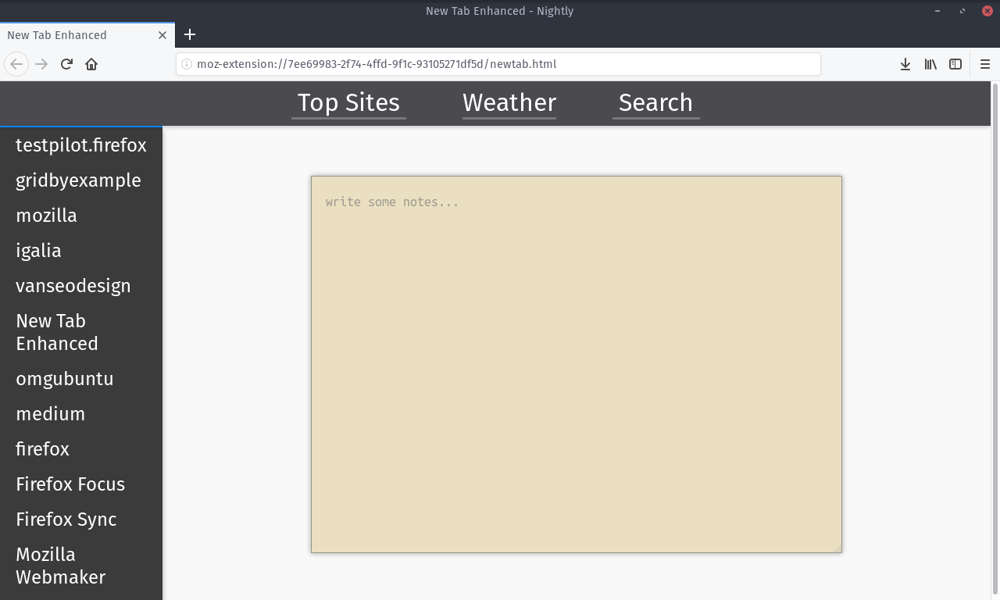
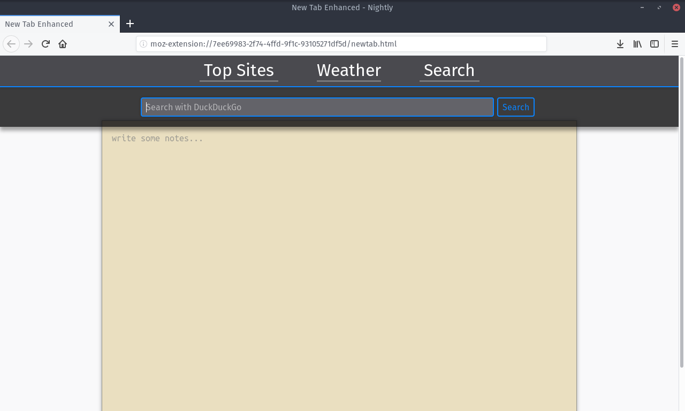

# Enhanced New Tab

### An enhanced new tab experience, for Firefox 54+ (and Chrome)

This addon will transform Firefox's new tab page into a notebook, links to weather and search, and a listing of top sites.

Notes:
---

 - Top sites will be the same as those loaded in about:newtab.  Pinned sites on that page will be respectively pinned on this extension's page.  

 - Weather links to DuckDuckGo's Weather Instant Answer feature, which uses [Dark Sky](http://darksky.net) as its source. It should show local weather based on your IP address, but location is configurable through the options page.

Screenshots:
---

### Top Sites

### Search

ToDo:
---
* [X] Implement Search as a dropdown searchbox

* [ ] Implement themes and theme chooser (light, dark, greyscale, colorful)

* [X] Custom location for weather (esp. for VPN users)

* [X] Add settings page

* [ ] Improve settings page

Credits
---

Credit for the initial work on the "notebook", and the initial base for this project, goes to [wildskyf's "tab-notes"](https://github.com/wildskyf/tab-notes/).

JavaScript for the topSites API from [Top-Sites](https://github.com/mdn/webextensions-examples/tree/master/top-sites) Webextensions example from MDN.

Weather links to [wttr.in](https://github.com/chubin/wttr.in), an open-source weather display utility.

Search links to [DuckDuckGo](https://duckduckgo.com), a search engine that doesn't track you.

Persistant notes on Chrome made possible with some code from [Sweenzor's "New Tab Notepad"](https://github.com/sweenzor/new-tab-notepad)
